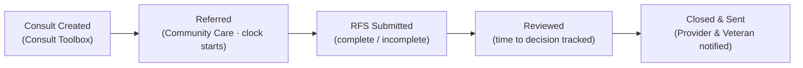
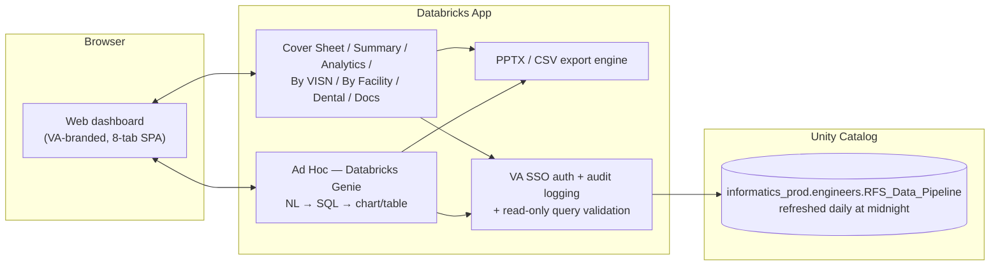

# CTB_RFS — Referral & RFS Reporting for VCC Community Care
### A White Paper on Functionality, Architecture, and Purpose

**Prepared for:** VA Office of Veterans Community Care — Integrated Veteran Care
**Live application:** `https://ctb-rfs-7405612657905892.12.azure.databricksapps.com`
**Data source:** `informatics_prod.engineers.RFS_Data_Pipeline` (Unity Catalog, refreshed daily at midnight)
**Date:** September 2026

> **Note on scope:** This white paper documents the live, authenticated Databricks
> App at the URL above ("CTB_RFS"), which was toured directly in-browser after VA
> SSO login. It is a distinct application from the `itu-claims-app` source
> checked into this workspace — that repo implements a separate IHS/THP/UIO
> claims dashboard. All content below reflects what the CTB_RFS app actually
> renders in production.

---

## 1. Executive Overview

**CTB_RFS** turns raw Consult Toolbox (CTB) activity into a single operational
picture of how **Requests for Service (RFS)** move through VA Community Care —
from the moment a consult is created to the moment a decision is closed and the
Veteran/provider are notified. It exists to answer one recurring operational
question: *where are referrals stalling, and who needs to act?*

**Live headline metrics (Cover Sheet, FY2026 to date):**

| Metric | Value |
|---|---|
| Total Referrals | 28,109,413 |
| Unique Patients | 5,724,714 |
| RFS Submissions | 5,531,469 |
| RFS Rate | 19.7% |
| Avg Open Days | 604.57 |

---

## 2. Who Uses It and Why

| Audience | Need | How CTB_RFS addresses it |
|---|---|---|
| Community Care referral coordinators | Identify referrals/RFS records stuck in the queue | Summary Detail's filterable detail table + open/closed day metrics per stop code |
| VISN and facility leadership | Compare timeliness and volume across networks/stations | By VISN and By Facility rollups |
| Dental program office | Track dental-specific referral compliance | Dedicated Dental tab with 5/10/30-day compliance bands |
| Program analysts / leadership briefings | Trend reporting and ready-made slides | Analytics pivots + one-click PPTX export from every page |
| Non-technical staff who need a quick answer | Ask a question without writing SQL | Ad Hoc tab, natural-language querying via Databricks Genie |

---

## 3. The RFS Lifecycle the App Is Built Around

The landing page documents the pipeline stages the entire data model is built on:

Every "open days" / "closed days" metric in the app is a measurement between two
of these stage timestamps — that's why the same handful of date-range filters
(Consult Activity Date, RFS Activity Date, Provider Letter Sent Date, Referral
Date, Submit Activity Date) appear consistently across every tab.

---

## 4. Functional Walkthrough (8 Tabs)

### 4.1 Cover Sheet
Landing view inside the authenticated app: top-line KPI band (Total Referrals,
Unique Patients, RFS Submissions, RFS Rate, Avg Open Days) plus a directory
card for each of the other seven tabs, so a new user can self-orient without
documentation. Includes a global **Export PPTX** button in the top nav.

### 4.2 Summary Detail
The main analysis workspace. A left-hand **Filters** rail (Fiscal Year, Fiscal
Quarter, Month/Year, VISN, Station, Category of Care, Service Category, CPRS
Status, Urgency, Request Service, Submission Complete, Primary Stop Code, plus
5 date-range pairs and free-text Patient ICN / Consult SID search) drives every
view. The main panel shows:
- KPI cards: RFS Submission Rate, RFS-to-Referral Ratio, Avg Referrals per
  Patient, Number of Referrals, Number of RFS's, Unique Patients, Avg Open
  Days, Avg Closed Days.
- Three sub-views via toggle: **Avg Days Close & Open** (a stop-code × month
  matrix of closed/open day counts), **Trends**, and **Details** — each with
  CSV export.

### 4.3 Analytics
Pivot-table style reporting: a "Summary of Category Consults by Type" matrix
(consult category × month, e.g. *Continuation of previously authorized care*,
*New procedure/service*, *New specialty care*, *Unspecified*) plus additional
VISN/RFS pivot matrices and stacked bar/line trend charts, all exportable to
CSV.

### 4.4 By VISN
A sortable, searchable, CSV-exportable table rolling up Total Referrals,
Unique Patients, Avg Open Days, Avg Closed Days, and RFS Submissions **per
VISN** (18 VISNs) — the fastest way to see which networks are lagging on
timeliness versus volume.

### 4.5 By Facility
The same rollup at facility granularity — **1,345 facility rows** in the live
data, each tagged with its VISN and station number, searchable by name and
exportable to CSV. This is the drill-down view for identifying specific
underperforming VA medical centers/CBOCs.

### 4.6 Dental
A purpose-built view for dental referrals, mirroring the KPI-band pattern but
scoped to dental-specific timeliness targets:
- Total Dental Referrals, Unique Patients, Avg Open/Closed Days, Submissions
  Complete.
- A dedicated **Timeliness Metrics** panel: Avg/Median Days to Close, 90th
  percentile days, and compliance bands (**Closed within 5 / 10 / 30 days**),
  plus average days to provider letter, veteran letter, and DOA (decision on
  authorization).

### 4.7 Documentation
An in-app reference library (PDF viewer embedded directly in the page) with:
Executive Summary, Document Index, Business Process Document, Data Workflow
Instructions, Plain Language Explanation, Standard Operating Procedures, Data
Dictionary, and UAT User Guides (for both the CTB_RFS app and its companion
Power BI report). This keeps governance/methodology documentation co-located
with the data it describes rather than in a separate SharePoint.

### 4.8 Ad Hoc — Natural-Language Reporting (Databricks Genie)
A chat-style query interface: type a question in plain English (e.g. *"Total
referrals by VISN for current FY"*) and Genie generates SQL, executes it
against the governed table, and renders both a chart and a data table with an
auto-written narrative summary. Every response exposes a **View SQL** control
so the generated query can be audited, and results can be exported to CSV or
PPTX. Verified live example:

> **Q:** "Total referrals by VISN for current FY"
> **A:** *"Current FY referral totals are available for 18 VISNs. Some of the
> highest totals are: V20: 1,597,011 · V17: 488,643 · V08: 483,877 · V16:
> 480,892 · V06: 458,565. Across the VISNs shown, V20 is a clear outlier with
> far more referrals than any other VISN, while the lowest total in the
> results is V02 with 114,780."*

---

## 5. Cross-Cutting Capabilities

- **Global filter rail** — the same ~17 filters (categorical + 5 date ranges +
  2 text search fields) apply consistently on Summary Detail, Analytics, By
  VISN, By Facility, Dental, and Ad Hoc, so a user can narrow scope once and
  page through every view without re-filtering.
- **Export everywhere** — every page-level export offers PPTX (native charts)
  and/or CSV; the Ad Hoc tab additionally exports its Genie-generated result
  set.
- **Light/dark theme toggle** persisted per user.
- **Fiscal-year-aware** throughout (FY2023–FY2026 selectable), consistent with
  VA's October-start fiscal year convention.

---

## 6. Security & Governance (as stated in-app)

The landing page's "Handled as Veteran data should be" section states the
following controls are implemented **in the service itself** because the app
reads protected health information:

| Control | Description |
|---|---|
| **Authenticated access** | Every request must carry a platform-verified identity (VA SSO via Databricks) before any query runs. |
| **Audit trail** | Access, filters applied, response status, and exports are all written to an audit log. |
| **Query validation** | Generated SQL (including Genie's natural-language-to-SQL output) is checked to be read-only and limited to approved tables. |
| **Read-only by design** | The dashboard never writes to the clinical record. |

Access is further restricted by data type/role, with escalation for broader
access routed through the **VHA National Data System (NDS)**.

---

## 7. Architecture (Observed)

- **Hosting**: Azure-hosted Databricks App (`*.azure.databricksapps.com`),
  fronted by Databricks' native OIDC/SSO login — the same auth pattern used by
  other VA Community Care Databricks Apps.
- **Single data source of truth**: one Unity Catalog table
  (`RFS_Data_Pipeline`), refreshed daily, feeding every tab — no page-specific
  duplicate pipelines.
- **AI-assisted analytics**: the Ad Hoc tab is a genuine Genie integration
  (not a canned FAQ) — it produces different SQL/results per free-text
  question and exposes the SQL for verification, directly addressing the
  "black box AI" concern for a PHI-adjacent tool.

---

## 8. Screenshots

All screenshots below were captured directly from the live, authenticated
application.

1. **Public landing page** — mission statement, RFS lifecycle diagram, feature
   grid, and the "Handled as Veteran data should be" safeguards section.
2. **Cover Sheet** — top KPI band + 7-tile page directory.
3. **Summary Detail** — full filter rail + KPI cards + Avg Days Closed/Open
   stop-code matrix.
4. **Analytics** — Category-by-month consult pivot table.
5. **By VISN** — 18-row VISN rollup table.
6. **By Facility** — 1,345-row searchable facility table.
7. **Dental** — dental-specific KPIs and 5/10/30-day timeliness compliance
   panel.
8. **Documentation** — embedded PDF library (Executive Summary shown).
9. **Ad Hoc** — Genie natural-language query, showing a live answer to "Total
   referrals by VISN for current FY" with narrative summary, chart, and table.

*(Screenshots captured in-session and available in the conversation; save any
you want to keep into the repo, e.g. under `docs/screenshots/`.)*

---

## 9. Summary

CTB_RFS consolidates Consult Toolbox / Request-for-Service activity — a
process that otherwise spans multiple systems and manual tracking — into one
governed, filterable, auditable reporting surface. Its distinguishing
strengths are **(1)** a consistent filter/export experience across every
analytical view, **(2)** dedicated timeliness instrumentation (open/closed
days, percentile compliance) tied directly to the actual RFS lifecycle stages,
and **(3)** a genuinely functional natural-language query tab (Databricks
Genie) that lets non-technical staff get governed, SQL-verifiable answers
without waiting on a report request.
